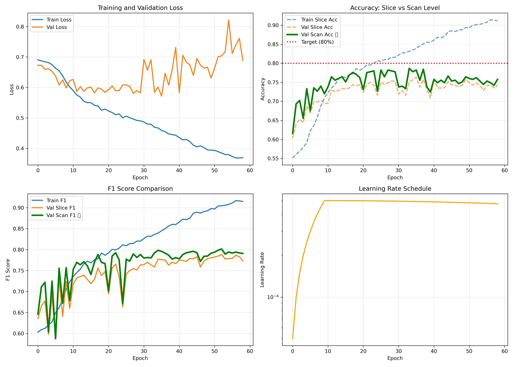
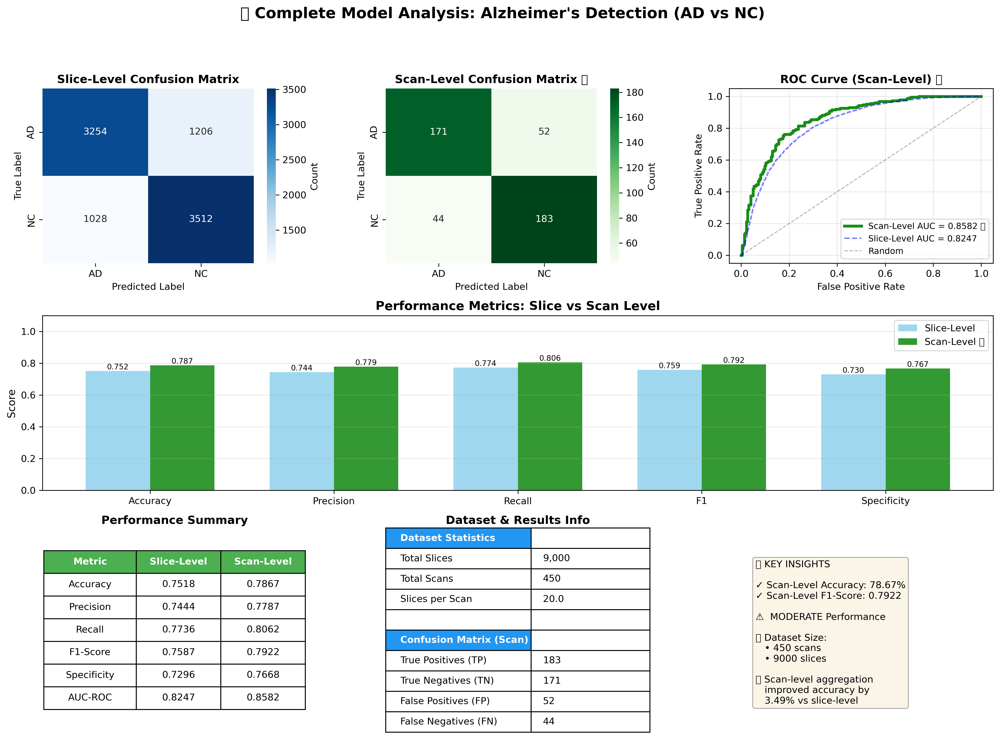
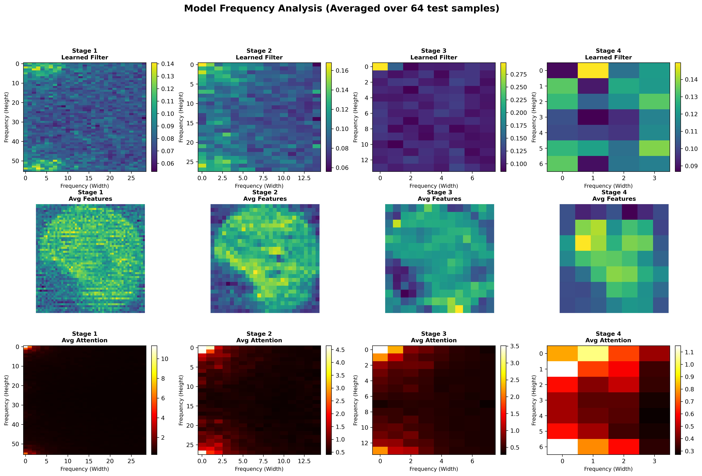
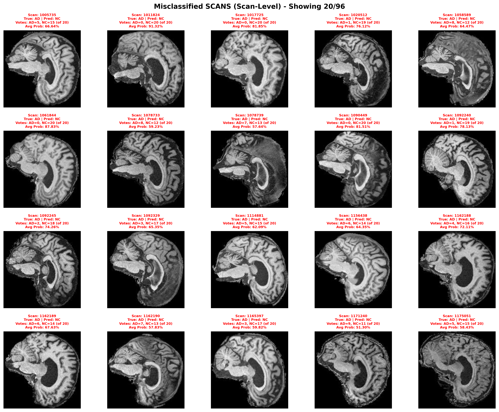

# Global Filter Network (GFNet) for Alzheimer's Disease Classification

## Table of Contents
- [Introduction](#introduction)
- [Dataset](#dataset)
- [Model Implementation](#model-implementation)
- [Training & Evaluation](#training--evaluation)
- [Results](#results)
- [Usage](#usage)
- [File Structure](#file-structure)
- [References](#references)

## Introduction

### GFNet
GFNet is a frequency-domain neural architecture that replaces self-attention layer in traditional Vision Transformers (ViT) models with a global filter layer.  


The Global Filter Layer consists of three main operations, namely:
1. 2D Discrete Fourier Transform (DFT) to convert the input spatial features to the frequency domain
2. Element-wise multiplication between frequency-domain features and the learnable global filter
3. 2D Inverse Fourier Transform (IDFT) to map the features back to the spatial domain


In relation to other traditional Convolutional Neural Networks (CNN) and transformer-style models, GFNet has the following advantages:
1. **Improved computational efficiency:** the total computational complexity is only O(NlogN) compared the quadratic complexity of ViT
2. **Scalability to higher resolutions:** both Fourier Transforms (FFT and IFFT) being able to process sequences with arbitary length without additional learnable parameters.This enables seamless interpolation across different input resolutions.

### Alzheimer's Disease (AD)
AD is the biological process that begins with the builup of proteins in the form of amyloid plaques and neurofibrillary tangles in the brain. As the result, brain cells die over time and causes the brain to shrink.

Currently, there is no known cure for AD. Nevertheless, medicines may improve symptoms or slow the decline in thinking, making it imperative diagnose AD as accurately and as early as possible. Over the last few decades, neuroimaging has moved from  minor to a central position in diagnosing AD. In particular, Magnetic Resonance Imaging (MRI) has helped in visualising progressive cerebral atrophy, which is a characteristic feature of neurodegeneration. 

Nevertheless, early diagnosis remains one of the current challenges in the field of neuroimaging Traditional CNNs are limited by their local receptive fields, while transformer-based models often demand large datasets to learn long-range dependencies effectively. GFNet offers a promising alternative by efficiently modeling global spatial relationships through frequency-domain filtering. 

In this study, GFNet is adapted to the Alzheimer’s Disease Neuroimaging Initiative (ADNI) MRI dataset to classify subjects into Alzheimer’s Disease (AD), and Normal Control (NC) groups.

## Dataset
This project uses the ADNI (Alzheimer's Disease Neuroimaging Initiative) dataset for binary classification of brain MRI scans into two classes:
* AD (Alzheimer's Disease): Diagnosed Alzheimer's patients
* NC (Normal Control): Cognitively normal subjects

**Dataset Statistic**
* Total Scans: 2,189 unique 3D MRI scans
* Total Images: 30,520 2D slices
* Train Set: 21,520 images from 1,076 unique scans
    - AD: 10,400 images (48.3%)
    - NC: 11,120 images (51.7%)
*Test Set: 9,000 images from 450 unique scans
    - AD: 4,460 images (49.6%)
    - NC: 4,540 images (50.4%)
*Average slices per scan: 20.0 slices
*Classes: 2 (AD, NC) - Well balanced at approximately 50/50

**Directory Structure**
```
ADNI/
├── meta_data_with_label.json
└── AD_NC/
    ├── train/
    │   ├── AD/    # 10,400 images
    │   └── NC/    # 11,120 images
    └── test/
        ├── AD/    # 4,460 images
        └── NC/    # 4,540 images
```

### dataset.py
In this file, the datasets are loaded and data augmentations are applied for GFnet training on ADNI AD/NC dataset. It also stores ADNIDatasetWithScanID class

### Data Augmentation
In the medical domain, data augmentation is important in improving a model robustness, especially in the case of low volume of datasets due to privacy issue or rarity of diseases. In this case, the size of the dataset is moderate, and thus appropriate data augmentation is needed to increase the effective variability of the training data, reduce overfitting and improve the model's generalisation to unseen MRI scans.

**Training**\
The training augmentation pipeline includes:
```ruby
train_transform = transforms.Compose([
        AutoCropBlack(threshold=10),
        transforms.Resize((img_size, img_size)),
        transforms.RandomAffine(
            degrees=8,                
            translate=(0.05, 0.05),   
            scale=(0.95, 1.05),       
            shear=None               
        ),
        transforms.RandomHorizontalFlip(p=0.5),
        transforms.ColorJitter(brightness=0.2, contrast=0.2),
        transforms.ToTensor(),
        transforms.Normalize(mean=[0.2670], std=[0.2657]),
        transforms.RandomErasing(p=0.5, scale=(0.02, 0.25))
    ])
```
<ins>Cropping & Scaling</ins>

```ruby
class AutoCropBlack:
    """Remove black borders from MRI scans"""
    def __init__(self, threshold=10):
        self.threshold = threshold
    
    def __call__(self, img):
        gray = img.convert('L')
        gray_np = np.array(gray)
        mask = gray_np > self.threshold
        
        if not np.any(mask):
            return gray
        
        coords = np.argwhere(mask)
        y0, x0 = coords.min(axis=0)
        y1, x1 = coords.max(axis=0) + 1
        
        return gray.crop((x0, y0, x1, y1))
```
AutoCropBlack is a custom transform that removes non-informative black borders from MRI scans. Many MRI images include large black regions outside the brain due to scanner padding or acquisition settings. AutoCropBlack converts the image to grayscale, identifies all pixels above a specified intensity threshold, and crops the image to the smallest rectangle containing these pixels. This ensures the model focuses on relevant brain structures, reduces background noise, and saves memory and computation during training

After cropping, each scan is scaled back up to consistent size to standardise the input dimensions across the dataset.

Notably, in A Comparative Analysis of Data Augmentation[^1] study found that crop & scale approach achieved the second-best classification accuracy, supporting the effectiveness of this technique for medical imaging tasks.

<ins>Random Affine</ins>\
RandomAffine applies small random rotations, translations, and scaling to each MRI slice, simulating natural variations that occur during patient positioning or image acquisition. In medical imaging, even slight head movements or scanner alignment differences can lead to spatial inconsistencies between scans. 

Hence, by introducing controlled geometric perturbations, this transformation enhances the model’s ability to generalize and accurately recognize brain structures under varying spatial conditions. The magnitude of each perturbation is adapted from studies on brain tumor detection, where morphological variations are more pronounced. In contrast, since Alzheimer’s-related structural changes are subtler, our chosen parameters are intentionally more conservative to preserve anatomical integrity and avoid excessive distortion.

<ins>Others</ins>\
Horizontal flipping is applied with a 50% probability to introduce left–right symmetry variations in the training data. Although brain structures are largely symmetrical, subtle asymmetries can occur due to individual anatomy or disease progression. Incorporating horizontal flips helps the model remain invariant to spatial orientation while still learning relevant lateralized features.

Color jittering adjusts brightness and contrast within controlled limits (±0.2), simulating natural intensity variations that may arise from different MRI scanners or acquisition parameters. This enhances the robustness of the model against scanner-dependent artifacts and illumination inconsistencies.

Following these augmentations, images are converted into tensors and normalized using the dataset’s mean and standard deviation, ensuring consistent input scaling across all batches. Finally, RandomErasing is applied with a probability of 0.5, randomly masking small regions of the image. This technique acts as a form of regularization, preventing the model from over-relying on specific local features and encouraging more distributed, context-aware learning of brain morphology.


**Testing**\
For testing and evaluation, only deterministic preprocessing steps are applied to ensure consistent result:
```ruby
test_transform = transforms.Compose([
        AutoCropBlack(threshold=10),
        transforms.Resize((img_size, img_size)),
        transforms.ToTensor(),
        transforms.Normalize(mean=[0.2670], std=[0.2657])
    ])
```
### ADNIDDatasetWithScanID
```ruby
class ADNIDatasetWithScanID(Dataset):
    def __init__(self, root_dir, transform=None):
        self.root_dir = root_dir
        self.transform = transform
        
        # Collect all image paths and labels
        self.samples = []
        self.scan_ids = []
        self.classes = sorted([d.name for d in Path(root_dir).iterdir() if d.is_dir()])
        self.class_to_idx = {cls_name: i for i, cls_name in enumerate(self.classes)}
        
        for class_name in self.classes:
            class_dir = Path(root_dir) / class_name
            for img_path in list(class_dir.glob('*.jpeg')):
                # Extract scan_id from filename
                filename = img_path.stem  # Remove extension
                
                # Split by underscore and take everything except the last part (slice number)
                parts = filename.split('_')
                if len(parts) >= 2 and parts[-1].isdigit():
                    # Last part is slice number, everything before is scan_id
                    scan_id = '_'.join(parts[:-1])
                else:
                    # Fallback: use entire filename as scan_id
                    scan_id = filename
                
                self.samples.append((str(img_path), self.class_to_idx[class_name]))
                self.scan_ids.append(scan_id)
    
    def __len__(self):
        return len(self.samples)
    
    def __getitem__(self, idx):
        img_path, label = self.samples[idx]
        scan_id = self.scan_ids[idx]
        
        # Load image
        image = Image.open(img_path).convert('L')
        
        if self.transform:
            image = self.transform(image)
        
        return image, label, scan_id
```
This class extends the standard PyTorch dataset to include scan-level metadata extraction from the file names of the ADNI dataset. Each MRI slice in the dataset is named following the format scanID_slicenumber.jpeg (e.g., 1031067_85.jpeg). This allows the dataset loader to identify not just the class label (e.g., AD or NC), but also the unique scan ID corresponding to the MRI volume from which each 2D slice originates.

This is crucial to implement scan-level

## Model Implementation
This project implements PyramidGFNet (PGFNet), a hierarchical extension of GFNet, which has 4 stages, each marked with varying fearure map resoultion. This design enables the network to learn both fine-grained local textures and high-level semantic representation, similar to vision transformers but with substantially lower computational overhead.


A study[^2] has shown that PGFNet achieved superior performance, rivaling the SOTA EfficientNet. Although the cited study evaluated PGFNet on a coal ash content estimation task, its relevance extends to MRI brain imaging because both involve analyzing fine-grained grayscale textures. In both coal imaging and MRI scans, the model must detect subtle intensity and structural variations rather than color cues. 

Furthermore SOTA EfficientNet is well known for capturing hierarchical spatial features effectively even in single-channel data. Hence, the fact that PGFNet rivals SOTA EfficientNet in such a grayscale-dependent and texture-sensitive task suggests that PGFNet can similarly excel in MRI-based classification, where discriminative patterns of brain tissue, rather than color differences, are crucial.

In this implementation, PGFNet architecture is implemented in three main variants:
| Variant  | Parameters |Depth |
| ------------- | ------------- |------------- |
| Tiny | ~13M  |[2, 2, 6, 2] |
| Small | ~26M  |[3, 4, 6, 3] |
| Base | ~44M  |[3, 4, 18, 3] |

## Training and Evaluation

### Training
training.py contains the main training loop for the model.

**Final Parameter**
```r
model_size='base',
drop_rate=0.1,
drop_path_rate=0.15,
        
# Training
img_size=224,
batch_size=24,
num_epochs=350,
learning_rate=5e-5,
min_lr=1e-7,
weight_decay=0.05,
warmup_epochs=10,
        
# Early stopping
early_stopping_patience=25,
min_delta=0.001,
        
# Augmentation 
use_mixup=True,
mixup_alpha=0.4, 
        
# Options
use_amp=True,

```
The model was trained using the PGFNet (Base) variant after the smaller variant plateaued at around 76–77% validation accuracy, suggesting that a deeper and higher-dimensional model was necessary to better capture the subtle morphological differences in Alzheimer’s pathology. The base configuration increases both embedding dimensions and hierarchical depth, enabling richer spatial-frequency representation of MRI features while remaining computationally efficient when trained with Automatic Mixed Precision (AMP).

Several key mechanisms are implemented to enhance generalisation and stability during training.

**Cross-Entropy Loss with Label Smoothing**\
A cross-entropy loss with label smoothing (ε = 0.1) is employed to prevent overconfidence and improve generalization. Label smoothing introduces controlled uncertainty in the target distribution, preventing the model from becoming overly certain about its predictions. This is particularly valuable in Alzheimer’s Disease (AD) classification, where MRI slices often contain ambiguous or subtle anatomical differences between AD and normal control (NC) subjects.

**Mixup Augmentation**\
Mixup is a technique where the learner combines pairs of training instances to produce a virtual third instance that is a linear combination of the two instances and their labels. Following the implementation of this approach in pyschosis fMRI classification[^3], the authors found that an optimal coefficient of α = 0.2 yielded the best performance. Psychosis and Alzheimer’s disease share similarities in terms of subtle, diffuse structural and functional brain changes, making Mixup a suitable augmentation for both.

However, in our study, we use α = 0.4, higher than the psychosis study. The reason is the fundamental difference in scan types. This project's dataset consists of structural MRI slices of the brain, each representing a discrete anatomical section, whereas fMRI captures dynamic functional activity over time. Slices in structural MRI can be more heterogeneous, and larger interpolation (higher α) allows the model to better generalize across patients and slice variability, without introducing unrealistic images. This adjustment helps the model learn robust representations for scan-level classification, mitigating overfitting and improving performance compared to using the lower 

**Early Stop Loss**\
Early stopping (patience = 25, min Δ = 0.001) was incorporated to prevent overtraining, particularly given the moderate dataset size. The patience value and small delta thresholds are chosen to allow the model a few epochs to recover from minor fluctuations in validation performance. This reduces the risk of stopping too early due to random noise in the validation set. Additionally, as training deep models like PGFNet can be time-intensive, early stopping allows us to halt training once performance plateaus, avoiding unnecessary epochs and reducing GPU hours.

**Slice Level vs Scan Level Training**\
Our model is trained to classify individual MRI slices as either AD or NC. Slice-level predictions allow the model to learn local patterns and subtle anatomical features in each 2D slice. However slice-level accuracy is inherently limited as many slices, especially in edge cases, contain very subtle markers of AD. Some slices may appear almost normal, and even expert radiologists might struggle to identify them. This makes slice-level classification a challenging task. 

Studies[^4] have found exture features extracted from a single axial slice of a T1-weighted (T1w) MRI scan achieved 93% accuracy on an internal test set. In contrast, using linear discriminant analysis with cortical thickness measurements, volumetric data, and hippocampal volume, shape, and texture features from a T1w MRI scan only reached 63% accuracy, highlighting that only certain slices carry the most predictive information for early AD detection.

To address this, we aggregate slice-level predictions to produce a scan-level classification using majority voting. This ensures that even if a few slices are misclassified, the overall scan prediction remains robust.

The distinction between slice-level and scan-level predictions informs our training strategies:
* Mixup is applied at the slice level to help the model generalize better.
* Early stopping is monitored at the slice level to prevent overfitting, while scan-level performance guides final model selection.

### Evaluation
After training, the model is evaluated at both slice-level and scan-level to assess its performance comprehensively.

**Slice-Level Evaluation**\
Each MRI slice is independently classified as AD or NC. Metrics such as accuracy, precision, recall, F1-score, specificity, and ROC-AUC are computed for all slices. Slice-level evaluation highlights the model’s ability to detect local anatomical patterns, though individual slices may contain subtle or ambiguous markers, particularly in early-stage cases.

**Scan-Level Evaluation**\
Slice-level predictions are aggregated to obtain scan-level classifications using majority voting. This captures the overall diagnostic decision per scan and typically improves performance by reducing the influence of ambiguous slices. Scan-level metrics mirror those at the slice level and include confusion matrices and ROC-AUC curves.

**Visual Analysis**\
* Misclassified scans are visualised to identify patterns in errors. 
* Comprehensive visualisations include confusion matrices, performance metric comparisons, ROC curves
* Model frequency analysis showing learned filters, feature maps, and attention patterns.

## Results
⚠️ Note: Results are not fully reproducible due to missing random seed control. Running the same training may produce results varying by ±1%.

The trained PGFNet model is evaluated using both slice-level and scan-level metrics. Slice-level evaluation measures the model’s ability to classify individual 2D MRI slices, capturing local anatomical patterns. Scan-level evaluation aggregates slice predictions to generate a single label per scan, providing a clinically meaningful assessment of the patient’s condition.

The PGFNet BASE model achieves a scan-level accuracy of 78.67%, with slice-level accuracy at 75.18%.

### Training History


The training curves reveal several important patterns about model behavior and learning characteristics. The model demonstrates early convergence, with scan-level accuracy plateating at 75-78% around epoch 20 despite continuing to train for 60 epochs. This early plateau suggests that the model has learned the main discriminative features quickly but lacks the capacity or optimisation strategy to push beyond this threshold. After epoch 30, a significant train-validation gap emerges, with training loss continuing to decrease from 0.5 to 0.36 while validation loss increases and becomes unstable, reaching peaks of 0.82. This widening gap is a clear indicator of overfitting, where the model begins to memorize training examples rather than learning generalizable patterns. Despite the validation loss instability between epochs 30-60, the scan accuracy remains relatively stable, suggesting that while the model's confidence calibration degrades, its prediction consistency is maintained through majority voting across slices.

The inability to reach the 80% target stems from multiple factors. The model architecture, while using the BASE variant with approximately 25M parameters, may still lack sufficient capacity to capture the subtle neuroanatomical changes associated with early-stage Alzheimer's disease. The learning rate schedule shows an aggressive warmup to full learning rate by epoch 10, which may cause the optimizer to overshoot optimal weight configurations.

Additionally, the overfitting observed after epoch 30 indicates insufficient regularization, suggesting that stronger techniques such as dropout, weight decay, or label smoothing are needed. The conservative augmentation strategy may not provide enough data variation during training. However, stronger or more aggressive augmentation could be problematic, given the delicate and subtle nature of the AD markers in MRI slices. Early-stage Alzheimer's markers can be extremely subtle, and even expert radiologists may struggle to detect them. Overly aggressive transformations risk distorting or removing these subtle features, which could confuse the model. Consequently, the inherent difficulty of the AD vs NC classification task, combined with limitations in slice-level information, contributes to the observed performance ceiling.

The optimization strategy shows clear signs of getting stuck in local minima, with the learning rate remaining constant after the initial warmup phase rather than gradually decaying. The model uses a warmup phase followed by a cosine decay scheduler. During warmup, the learning rate ramps up linearly from 0 to the initial learning_rate. After warmup, the scheduler applies cosine decay toward min_lr.

However, in practice, the learning rate appeared roughly constant after warmup. This happens because the min_lr / learning_rate ratio is very small (1e-7 / 5e-5 = 0.02), and the cosine decay starts near 1.0, so the decay is very slow over the number of training steps, especially early in training. As a result, the optimizer continues taking relatively large steps, limiting fine-tuning near local minima and contributing to the plateau in performance.

### Complete Analysis


**Confusion Matrix**\
The scan-level confusion matrix reveals important patterns in the model's prediction behavior. For Alzheimer's Disease cases, the model correctly identifies 171 out of 223 cases (True Positives) with a recall of 80.62%, meaning it successfully detects approximately 4 out of 5 AD patients. However, it misclassifies 52 AD cases as Normal Control (False Negatives), representing a 23.3% miss rate that could have serious clinical implications as these patients would not receive early intervention. For Normal Control cases, the model correctly identifies 183 out of 227 cases (True Negatives) with a specificity of 76.68%, but incorrectly flags 44 healthy individuals as having AD (False Positives). This relatively balanced error distribution (52 FN vs 44 FP) suggests the model does not exhibit strong bias toward either class, though the slightly higher false negative rate indicates a tendency to under-diagnose AD in ambiguous cases.

The slice-level confusion matrix shows a similar pattern but with lower overall accuracy, demonstrating why scan-level aggregation is crucial. At the slice level, the model achieves 3,254 true AD predictions and 3,512 true NC predictions, but makes 1,206 false negative errors and 1,028 false positive errors. The higher number of slice-level false negatives compared to scan-level illustrates how individual slice predictions can be noisy, but majority voting across slices successfully filters out much of this noise to produce more reliable scan-level diagnoses.

**ROC Curve**\
The ROC curve (Receiver Operating Characteristic) is an essential diagnostic tool for evaluating medical classification models. It plots the true positive rate (sensitivity) against the false positive rate (1 - specificity) at various decision thresholds, providing a comprehensive view of the model’s ability to discriminate between Alzheimer’s Disease (AD) and Normal Control (NC) cases.

Unlike accuracy, which depends on a fixed threshold, the ROC curve shows performance across all thresholds, making it particularly valuable for imbalanced or ambiguous medical datasets where the cost of false negatives (missed diagnoses) is high. The Area Under the ROC Curve (AUC) quantifies this performance, where an AUC closer to 1.0 indicates a strong ability to distinguish between AD and NC, while 0.5 suggests random guessing.

The ROC curve visualization displays both slice-level (AUC = 0.8247, dashed line) and scan-level (AUC = 0.8582, solid green line) performance, providing a clear comparison of discriminative ability at different aggregation levels. Both curves perform substantially better than random chance (diagonal dashed line), with the scan-level curve consistently dominating the slice-level curve across all false positive rates, demonstrating the benefit of majority voting aggregation. The scan-level curve shows particularly strong performance in the critical low false-positive region (0-0.2 FPR), where it achieves approximately 60-70% true positive rate while maintaining very low false positives—an ideal characteristic for a screening tool. The smooth, convex shape of both curves without significant irregularities suggests stable model predictions across different probability thresholds.

The scan-level AUC of 0.8582 means that if we randomly select one AD scan and one NC scan, the model correctly ranks the AD scan as more likely diseased 85.82% of the time. However, as highlighted in a study[^5], a high AUC alone does not guarantee clinical usefulness: it does not capture the absolute error rates, misclassification costs, or the distribution of borderline/early-stage cases. Additional metrics like sensitivity, specificity, and precision‑recall trade-offs are critical to understanding the model’s practical performance in real-world diagnostic settings.

**Performance Metrics**\
Across all metrics, scan-level performance consistently exceeds slice-level performance, validating the majority voting approach. Accuracy improves from 75.18% to 78.67% (+3.49%), precision increases from 74.44% to 77.87% (+3.43%), recall rises from 77.36% to 80.62% (+3.26%), and F1 score gains from 75.87% to 79.22% (+3.35%). Interestingly, specificity shows a smaller improvement from 72.96% to 76.68% (+3.72%), and actually remains the weakest metric at the scan level, suggesting the model has more difficulty correctly identifying healthy controls than AD patients. The AUC-ROC also improves from 0.8247 to 0.8582 (+3.35%), indicating better separation between classes when predictions are aggregated. This consistent 3-4% improvement across all metrics demonstrates that the model's slice-level predictions, while individually noisy, contain reliable signal that becomes apparent when combined through majority voting.

### Model Frequency Analysis



### Misclassified Samples



## Usage
### Dependencies
```ruby
# Deep Learning Framework
torch>=1.8.0              # Required for torch.fft (rfft2/irfft2)
torchvision>=0.15.0

# Model Components
timm>=0.9.0               # PyTorch Image Models (for DropPath)

# Numerical & Image Processing
numpy>=1.24.0
Pillow>=9.0.0             # PIL for image loading

# Data Analysis
pandas>=1.5.0             # For CSV handling and predictions

# Visualization & Metrics
matplotlib>=3.7.0
seaborn>=0.12.0           # Enhanced plotting for confusion matrices
scikit-learn>=1.2.0       # Metrics and evaluation

# Progress & Utilities
tqdm>=4.65.0              # Progress bars

# Standard Library (Built-in)
os, pathlib, collections, functools, json, math, warnings, random
```

### Training
**Basic usage**
```
python train.py
```
**Custom parameters**\
Modify the default parameter
```ruby
# Model parameters
model_size='small'              # Options: 'tiny', 'small', 'base'
drop_rate=0.1
drop_path_rate=0.15

# Training parameters
img_size=224
batch_size=24
num_epochs=250
learning_rate=1e-4
min_lr=1e-7
weight_decay=0.05
warmup_epochs=10

# Early stopping
early_stopping_patience=25
min_delta=0.001

# Augmentation
use_mixup=True
mixup_alpha=0.2

# Options
use_amp=True                   
use_class_weights=False

# Data
data_dir="/home/groups/comp3710/ADNI/AD_NC"
num_workers=4

# Save
save_dir="./checkpoints_scan_level"
```

### Evaluation
**Basic usage**
```
python predict.py
```

## File Structure

```
recognition/
└── GFNet-s4979971
    ├── dataset.py      # Data loader and preprocessing
    ├── modules.py      # Model components (GFBlock, GlobalFilter, GFNet)
    ├── train.py        # Training and validation
    ├── predict.py      # Evaluating the accuracy of a given model
    ├── README.md       # This file
    ├── images          # Folder containing diagrams and visualisation
```

## References - TBC
1. Barkhof, F., Hazewinkel, M., Binnewijzend, M., & Smithuis, R. (2022, March 3). Dementia - role of MRI. Radiology Assistant. https://radiologyassistant.nl/neuroradiology/dementia/role-of-mri 
2. Inglese, M., Patel, N., Linton-Reid, K., Loreto, F., Win, Z., Perry, R. J., Carswell, C., Grech-Sollars, M., Crum, W. R., Lu, H., Malhotra, P. A., & Aboagye, E. O. (2022a, June 20). A predictive model using the mesoscopic architecture of the living brain to detect alzheimer’s disease. Communications Medicine. https://www.nature.com/articles/s43856-022-00133-4 
3. Inglese, M., Patel, N., Linton-Reid, K., Loreto, F., Win, Z., Perry, R. J., Carswell, C., Grech-Sollars, M., Crum, W. R., Lu, H., Malhotra, P. A., & Aboagye, E. O. (2022b, June 20). A predictive model using the mesoscopic architecture of the living brain to detect alzheimer’s disease. Communications Medicine. https://www.nature.com/articles/s43856-022-00133-4 
4. Islam, T., Hafiz, Md. S., Jim, J. R., Kabir, Md. M., & Mridha, M. F. (2024, June 5). Https://www.sciencedirect.com/science/article/abs/pii/S1047847720300046?via=ihub. Science Direct. https://www.med.upenn.edu/pmi/events/https-www-sciencedirect-com-science-article-abs-pii-s1047847720300046-via-3dihub 
5. Johnson, K. A., Fox, N. C., Sperling, R. A., & Klunk, W. E. (2012, April). Brain Imaging in alzheimer disease. Cold Spring Harbor perspectives in medicine. https://pmc.ncbi.nlm.nih.gov/articles/PMC3312396 
6. Krishnapriya, S., & Karuna, Y. (2023, April 20). Pre-trained deep learning models for brain MRI image classification. Frontiers in human neuroscience. https://pmc.ncbi.nlm.nih.gov/articles/PMC10157370/ 
7. Mayo Foundation for Medical Education and Research. (2024, November 8). Alzheimer’s disease. Mayo Clinic. https://www.mayoclinic.org/diseases-conditions/alzheimers-disease/symptoms-causes/syc-20350447 
8. Rao, Y., Zhao, W., Zhu, Z., Lu, J., & Zhou, J. (2021, October 26). Global Filter Networks for Image Classification. arXiv.org. https://arxiv.org/abs/2107.00645 
9. Safdar, M. F., Alkobaisi, S. S., & Zahra, F. T. (2020, March). A comparative analysis of data augmentation approaches for Magnetic Resonance Imaging (MRI) scan images of brain tumor. PubMed Central. https://pmc.ncbi.nlm.nih.gov/articles/PMC7085309/ 
10. Smucny, J., Shi, G., Lesh, T. A., Carter, C. S., & Davidson, I. (2022, September 30). Https://www.sciencedirect.com/science/article/abs/pii/S1047847720300046?via=ihub. Science Direct. https://www.med.upenn.edu/pmi/events/https-www-sciencedirect-com-science-article-abs-pii-s1047847720300046-via-3dihub 
11. Zhang, K., Wang,  eidong, Cui, Y., LV, Z., & Fan, Y. (2024, January). GFNet: A pioneering approach for precisely estimating ash content in coal through the fusion of graph convolution and feedforward network. Science Direct. https://www.med.upenn.edu/pmi/events/https-www-sciencedirect-com-science-article-abs-pii-s1047847720300046-via-3dihub 

[^1]: https://pmc.ncbi.nlm.nih.gov/articles/PMC7085309/
[^2]: https://www.sciencedirect.com/science/article/pii/S0952197623014859
[^3]: https://www.sciencedirect.com/science/article/pii/S2213158222002790
[^4]: https://www.nature.com/articles/s43856-022-00133-4
[^5]: https://pmc.ncbi.nlm.nih.gov/articles/PMC12260203/
